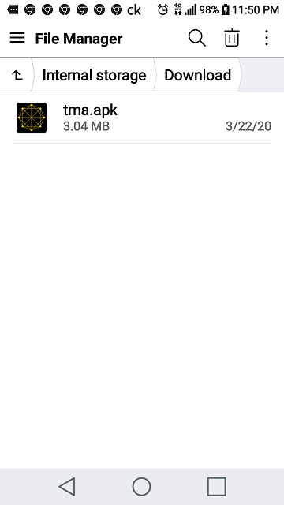
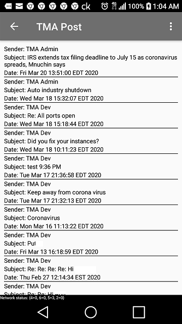
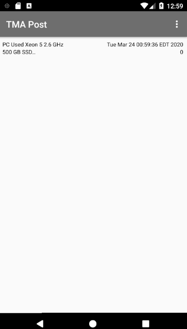

TMA Post App is an Android application, which allows users to use functionality below to interact with the TMA Coin network.

You can read more about TMA Coin Network by reviewing the link below:

https://github.com/tmacoin/tma/blob/master/README.md

TMA Post App functionality includes the following main and sub menus:

* File menu: allows users to import, export, and copy files; in addition, they can view system logs and show peers
* Tools menu: allows users to change their password, get balances, and send Coins.
* Messaging: allows users to send secure encrypted messages between TMA addresses.
* Tmitter: similar to twitter but with a few modifications; explained below
* Posting announcements,  which can be used as decentralized, distributed, uncensored version of Yelp, Craiglist or eBay.

Tma Post App does not require downloading of blockchain and can be installed and started quickly; most importantly, TMA Post App uses less resources on your phone. 

<b>Quick Installation:</b>

1. Execute installation steps 1 - 6 below, ignoring anything about keys.csv file.
2. Enter a passphrase, and most important, remember it. &nbsp;&nbsp;&nbsp;&nbsp; note: no one can restore it for you.
3. Send an email to tmacoin@yahoo.com and request 2 TMA Coins/partial coins.
4. Check if you received the coins by selecting My Balance under Tools main menu item.
5. Done, start sending Messages and Posting.

<b>Installation instructions:</b>

1. Go to your phone's Download directory(either phone internal or SD ok). 

   
   

2. Click on the  <a href="tma.apk" tagret="_blank" download="tma.apk">tma.apk</a> file in the this directory(i.e. github tmapostapp directory) and select the download button(next to the History button). Download it to your Download directory from step one above.

3. If you already have keys.csv file with existing keys, just copy it to your phone's Download directory, otherwise, it will create new key. 
4. Double click on the tma.apk file located in your phone's Download directory from step one above. 

   
   
5. Click Install

   

6. Once installed, select Open. Important: if you have a Keys.csv file, copy it to the Download directory before you select Open.

<b>Logging in to App</b>
    
   

7. First time users, press Cancel; otherwise, press Ok if the keys.csv was copied to your phone's Download directory.
    
    

If you do have a keys.csv file and passphrase, it will prompt you for the existing passphrase. The example exhibit below is the prompt when a user  copied their existing keys.csv file to the Download directory and then started the app.
    
   

Once logged in, it will display your address.

To access the main menu, select the ellipsis or dot menu located on the upper right corner. This will display the main menu.

  

<b>File sub menu:</b> allows users to import, export, and copy files; in addition, they can view system logs and show peers
* Stop Message Listener: if this app stops responding, select this option
* Import File: select a file to import(see exhibit below)
* Export File: select a file to export(see exhibit below)
* View Log: this is used to identify any issues with app
* Shop Peers: this list peers connected to the same instance you are connected
    
 

 Import File:
 
 

 Export File:
 
 
 

<b>Tools sub menu:</b> allows user to change their password, get balances, and send Coins.
* Change Password: allows user to change their password
* Get Any Balance: allows user to enter any address and retrieve its balance
* Get My Balance: allows user to get their current balance 
* Send Coins: allows user to send coins
* Show Address: allows user to see their current address

 Change Password:
 
 
 
 Get Any Balance:
 
 
 
 Get My Balance:
 
 
 
 
 Send Coins
* Recipient TMA Address: this is the address your are sending TMA Coins 
* Amount in Coins: number of coins you are sending
* Fee in satoshis: the fee you are charging to send TMA Coins
* Data: information related to transaction; this data is never deleted
* Expiring after # blocks: Expire data after this number of blocks created(after this transaction added to a block)
* Expiring Data: this data will expire after the number of blocks created after this transaction added to a block

  note: data is in clear text human readable form

 

Show Address:

<b>Secure Messaging sub menu:</b>
* Send Secure Messaging: allows user to send a Secure Encrypted message.
* Show messages: allows user to view a list of their messages

Send Secure(similiar to cellular text messaging):
* Recipient TMA Address: this is the address your are sending money 
* Fee in satoshis: the fee you are charging to send Coins
* Expiring after # blocks: data to expire or deleted after number of blocks created after the block to include this transaction
* Subject: information which will expire
* Body: information which will expire after number blocks mined

Show Messages:

You can create aliases for your contact addresses

<b>Tmitter sub menu:</b>
* Create Tmitter: allows user to create Tmitter account for current TMA Coin address
* Show my Tmeets: list number of Tmeets user sent            
* Send Tmeets: allows user to send Tmeets to user's subscribed to your account
* Search Tmeet: allows user to list Tmitter received for a specific Tmitter Account you subscribed (case sensitive)
* My Subscription: allows you to see latest Tmeets for the Tmeet accounts you have subscribed (note: there is no notification when you receive a Tmeet)

Create Tmitter

Show my Tmeets:

Send Tmeets:

Search Tmeets:

My Subscription:

<b>Posts sub menu:</b>
* Create Post: allows user to create a Posting account on TMA Coin Network
* Find Post: allows user to find a Posting by entering a Posting Account and keywords        
* My Ratings: list your ratings of a particular Post on TMA Coin Network
* My Posts: list all your Posts submitted to TMA Coin Network

Create your own posts or submit reviews of any other posts. The number of keywords is dependent upon the number of times someone sent you Coins minus one or (n-1). For example, if someone sent one TMA Coin(or partial TMA Coin) three times, you can enter two keywords.

Find Posts

My Ratings

My Posts

Posts and reviews are stored on TMA blockchain and can be only removed by the original poster. As any other blockchain it is censorship free.

